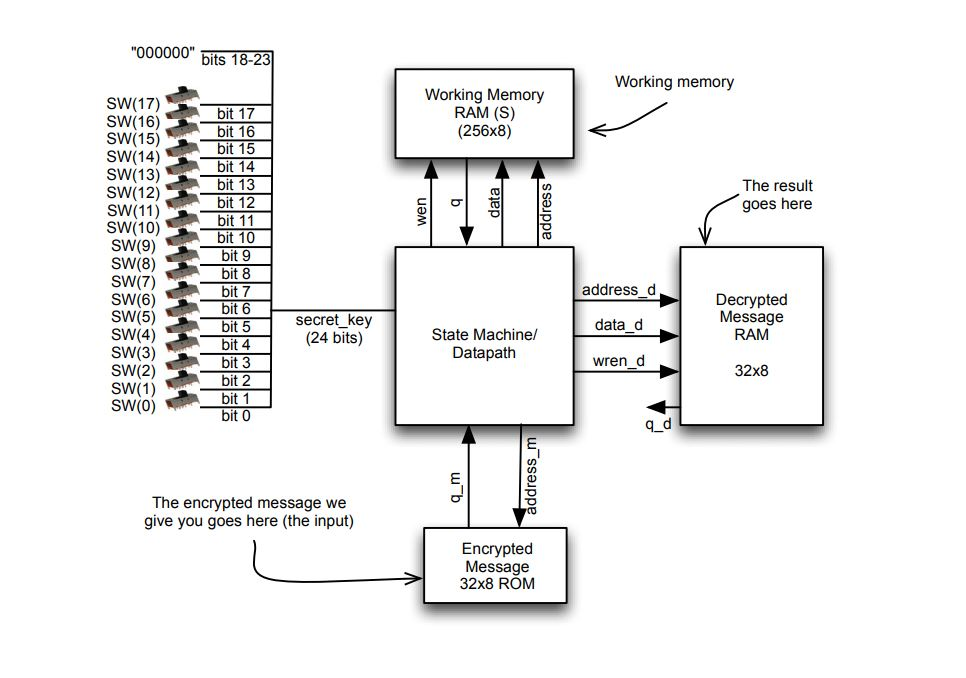

# RC4 Decryption Circuit

The goal is to create an RC4 decryption circuit on an FPGA. It uses a brute
force method to decrypt encrypted messages.

## RC4 Decryption Algorithm

```
/** Input: 
* secret_key [] : array of bytes that represent the secret key. In our
* implementation, we will assume a key of 24 bits, meaning this array is 3 
* bytes long 
* 
* encrypted_input []: array of bytes that represent the encrypted message.
* In our implementation, we will assume the input message is 32 bytes 
* 
* Output: 
* decrypted _output []: array of bytes that represent the decrypted result. 
* This will always be the same length as encrypted_input [].
* */

int i, j, k, f, temp;

// Step 1: Initialize the array s.
for(i = 0; i < 255; i++) {
    s[i] = i;
}

// Step 2: Shuffle the array based on the secret key.
j = 0;
for(i = 0; i < 255; i++) {
    j = (j + s[i] + secret_key[i % keylength]) % 256; // keylength is 3

    // Swap s[i] and s[j]
    temp = s[i];
    s[i] = s[j];
    s[j] = temp;
}

// Step 3: Compute one byte per character in the encrypter message.
i = 0;
j = 0;
for(k = 0; k < message_length - 1; k++) {
    i = (i + 1) % 256;
    j = (j + s[i]) % 256;

    // Swap s[i] and s[j]
    temp = s[i];
    s[i] = s[j];
    s[j] = temp;

    f = s[ (s[i] + s[j]) % 256 ];
    decrypted_output[k] = f ^ encrypted_input[k];
}

```

## Design Schematic



## Relevant Files

1. `ksa.sv` is the top level module where all parts of the system are connected
2. `task1.sv` contains step 1 of the RC4 decryption algorithm above.
3. `task2a.sv` contains step 2 of the RC4 decryption algorithm above.
2. `task2b.sv` contains step 3 of the RC4 decryption algorithm above.
